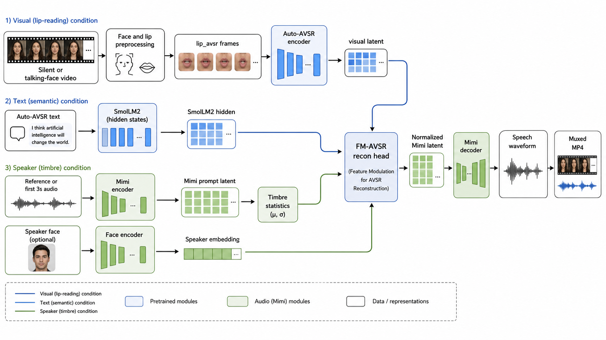

# StreamLip Audio Reconstruction

**Project page:** https://2omegaxv.github.io/StreamLip/

This worktree contains the current StreamLip deterministic audio reconstruction
pipeline, with StreamLip V5 as the default visual-to-text branch for raw-video
inference. The active script surface is intentionally small:

Project page assets live under `docs/`. To publish with GitHub Pages, select
`main` branch and `/docs` as the Pages source.



**Trump demo.** The example below is the checked-in Trump silent/reference demo
output. The model uses a short reference-audio segment for timbre conditioning,
reconstructs the target speech audio, and muxes it back to the face video.


The mp4 source for the GIF is
`data/assets/trump_silent_ref_demo/trump_silent_ref_demo_full_pred_post3s.mp4`.
Additional non-Trump generated examples are kept under
`data/assets/demo_videos/`.

```text
scripts/train_fm_avsr.py
scripts/eval_fm_avsr.py
scripts/extract_avsr_enc.py
scripts/extract_v5_text.py
scripts/extract_smollm2_h.py
scripts/extract_speaker_emb.py
scripts/extract_timbre_cond.py
scripts/decode_v5.py
scripts/preprocess_lrs3.py
scripts/preprocess_worker.py
scripts/reprocess_worker_avsr.py
scripts/run_preprocess_worker_no_flash_attn.py
scripts/run_raw_video_avsr_recon_pipeline.py
scripts/gradio_avsr_gui.py
```

The default raw-video command uses the local `ckpt/` directory. This directory
is intentionally not part of the git history; restore it from the released
checkpoint repository before running inference.

```text
ckpt/
├── auto-avsr/
│   └── vsr_trlrs2lrs3vox2avsp_base.pth
├── mimi/
│   ├── config.json
│   ├── model.safetensors
│   └── preprocessor_config.json
├── norm/
│   └── latent_norm_stats.npz
├── recon/
│   ├── streamlip_recon_residual_base_step_005000.pt
│   └── streamlip_recon_timbrefix_step_002000.pt
├── smollm2-360m/
│   └── ...
├── speaker/
│   └── resnet50-11ad3fa6.pth
├── streamlip-v5-lm/
│   └── ...
└── v5/
    └── streamlip_v5_olmo_step_001500_infer.pt
```

Legacy v2/v3/v4, Mimi-code, teacher-cache, and sweep scripts are archived under
`archive/scripts/`.

## Current Documentation

Use these files for the current implemented system:

```text
doc/fm_avsr_final_status_2026-06-04.md
doc/fm_avsr_audio_generation_architecture.md
doc/raw_video_avsr_recon_pipeline_usage.md
report/fm_avsr_final_report_2026-06-05.pdf
poster/DL poster project 23.pdf
```

Historical proposal, literature, early design, and old paper-reading materials
are archived under `archive/`. The original StreamLip V5 training scripts and
development note are preserved under `archive/scripts/v5_training/` and
`archive/docs_legacy/v5_training/`; they document the V5 research process but
are not the default release entry point.

## Environment

Install system tools first. The pipeline shells out to `ffmpeg` and `ffprobe`;
Python packages alone are not enough.

```bash
sudo apt-get update
sudo apt-get install -y ffmpeg
```

Create a Python 3.10 virtualenv and install the single runtime requirements
file:

```bash
python3.10 -m venv .venv
.venv/bin/pip install --upgrade pip
.venv/bin/pip install -r requirements.txt
```

Restore the model files under `ckpt/`. The recommended release layout is a
small project-specific Hugging Face model repository plus public pretrained
dependencies from HF mirror.

```bash
export HF_ENDPOINT=https://hf-mirror.com
export STREAMLIP_CKPT_REPO='pancx/streamlip-audio-recon-ckpt-pub'

.venv/bin/python -m pip install -U huggingface_hub

# Our trained weights and pinned runtime files.
.venv/bin/hf download "$STREAMLIP_CKPT_REPO" \
  --repo-type model \
  --local-dir ckpt

# Public pretrained dependencies.
.venv/bin/hf download kyutai/mimi \
  --local-dir ckpt/mimi

.venv/bin/hf download HuggingFaceTB/SmolLM2-360M \
  --local-dir ckpt/smollm2-360m
```

After download, the directory should look like:

```text
ckpt/mimi
ckpt/smollm2-360m
ckpt/streamlip-v5-lm
ckpt/auto-avsr/vsr_trlrs2lrs3vox2avsp_base.pth
ckpt/speaker/resnet50-11ad3fa6.pth
ckpt/norm/latent_norm_stats.npz
ckpt/v5/streamlip_v5_olmo_step_001500_infer.pt
ckpt/recon/streamlip_recon_timbrefix_step_002000.pt
ckpt/recon/streamlip_recon_residual_base_step_005000.pt
```

Verify the environment before running inference:

```bash
.venv/bin/python scripts/check_env.py
```

On CPU-only machines, use `--skip-cuda` only for dependency inspection. Raw
video inference is designed for CUDA and is not practical on CPU.

The default pipeline and GUI use the current timbre-fix recon checkpoint:

```text
configs/fm_avsr_lipavsr_59144_timbre3s_audioprompt38_pool_promptstats005_residual_samplecorr02_lossstart38_from1500_recon_textjson_wordts.yaml
ckpt/recon/streamlip_recon_timbrefix_step_002000.pt
```

The raw-video pipeline now uses StreamLip V5 as the default visual-to-text
model. V5 is our self-trained VSR branch: it consumes frozen Auto-AVSR visual
speech features and decodes them with an LM-based decoder using visual
cross-attention. This keeps the submitted system self-contained around the
StreamLip pipeline instead of presenting the text branch as a black-box external
decoder.

The visual encoder latent is still saved as `avsr_enc_lipavsr.npy` because it
is the shared 768-d visual speech feature consumed by both StreamLip V5 and the
audio recon head. StreamLip V5 decodes that latent into
`streamlip_v5_text.txt`, and SmolLM2 hidden states are extracted as
`smollm2_h_v5.npy`.

This design is intentionally not a pure vision-to-text-to-audio cascade. Text is
an auxiliary semantic condition, while lip/visual features, Mimi audio latents,
and timbre/audio-prompt latents carry the main reconstruction signal. Our
experiments show that replacing the text source with less accurate decoded text
or StreamLip V5 text only mildly changes audio reconstruction metrics, so V5's
role is to provide a trainable in-project semantic branch without making
perfect transcript accuracy the bottleneck for perceptual audio recovery.

For ablation or compatibility checks, the old decoded-text path is still
available with `--text_model avsr`.

## Raw Video Pipeline

### Video With Audio

Run one input video end to end. For a normal video with audio, the first 3.04
seconds of the input audio are used as the same-clip timbre/audio prompt and
are removed from the listening output:

```bash
.venv/bin/python \
  scripts/run_raw_video_avsr_recon_pipeline.py \
  --input /path/to/input_with_audio.mp4 \
  --exp my_video_demo \
  --force
```

The script performs:

```text
raw mp4/mov
-> 224x224 25fps video + 24kHz mono audio
-> face.npz/audio.wav/lip.npy
-> lip_avsr.npy
-> Mimi latent
-> avsr_enc_lipavsr.npy
-> streamlip_v5_text.txt
-> smollm2_h_v5.npy
-> speaker_emb.npy + timbre_cond.npy
-> StreamLip recon
-> post-3.04s generated mp4
```

Important outputs are written under `eval_out/<exp>/`:

```text
<exp>_pred_prompt3s_post3s.mp4
<exp>_gt_mimi_post3s.mp4
recon_lipavsr_prompt3s/0000_pred.wav
recon_lipavsr_prompt3s/0000_gt.wav
recon_lipavsr_prompt3s/metrics.json
vis_reprocess_avsr/face_lip_avsr_side_by_side_with_audio.mp4
vis_reprocess_avsr/lip_avsr_crop_with_audio.mp4
```

The first 3.04 seconds are used as same-clip audio/timbre prompt and are removed
from the exported listening videos. The local development file `data/trump.mov`
is not committed because root-level `data/*.mov` and `data/*.mp4` files are
treated as local raw inputs. Committed demo outputs live under
`data/assets/demo_videos/`.

### Silent Reference Demo

Silent mode now uses the same prompt layout as training. When `--ref_audio` is
provided, the pipeline builds a temporary input video with a black 3.04-second
prefix, places the first 3.04 seconds of the reference audio under that prefix,
then appends the silent target video with silent audio. The model therefore sees
the reference as the same-clip first-3-second audio prompt. The exported result
is cropped after the prompt prefix, so the final video keeps the target silent
video duration.

```text
data/assets/trump_silent_ref_demo/trump_silent_input_no_tail3s.mp4
data/assets/trump_silent_ref_demo/trump_ref_tail3s.mp4
data/assets/trump_silent_ref_demo/trump_silent_ref_demo_full_pred_post3s.mp4
```

The checked-in silent input was prepared from a local Trump source video by
removing its final 3 seconds and stripping all audio. The reference file can be
an audio file or a video file with audio. For best timbre control, use an
unmasked segment from the same source video as `--ref_audio`; its first 3.04
seconds should contain valid speech.

If `--silent_input` is used without `--ref_audio`, the pipeline keeps the video
silent for preprocessing and uses the default zero audio prompt and zero timbre
condition.

Current hack / TODO: the model can copy the prompt audio into the first
generated seconds. The black-prefix concat keeps this copy-prone region outside
the target video, and silent-mode exports crop it away after inference.

Reproduce the generated output:

```bash
.venv/bin/python \
  scripts/run_raw_video_avsr_recon_pipeline.py \
  --input data/assets/trump_silent_ref_demo/trump_silent_input_no_tail3s.mp4 \
  --ref_audio data/assets/trump_silent_ref_demo/trump_ref_tail3s.mp4 \
  --silent_input \
  --exp trump_silent_ref_demo_full \
  --force
```

Expected generated video:

```text
eval_out/trump_silent_ref_demo_full/trump_silent_ref_demo_full_pred_post3s.mp4
```

The timbre-fix checkpoint was also verified on the same preprocessed Trump
silent-reference example:

```text
eval_out/trump_silent_ref_demo_full_e2_lossstart38/trump_silent_ref_demo_full_e2_lossstart38_pred_post3s.mp4
```

## GUI

Start the Gradio UI:

```bash
.venv/bin/python \
  scripts/gradio_avsr_gui.py \
  --port 7860
```

Open:

```text
http://0.0.0.0:7860
```

The GUI calls the same `scripts/run_raw_video_avsr_recon_pipeline.py` backend.

## Verified Example

The checked-in reproducible demo uses the silent/reference Trump assets:

```bash
.venv/bin/python \
  scripts/run_raw_video_avsr_recon_pipeline.py \
  --input data/assets/trump_silent_ref_demo/trump_silent_input_no_tail3s.mp4 \
  --ref_audio data/assets/trump_silent_ref_demo/trump_ref_tail3s.mp4 \
  --silent_input \
  --exp trump_silent_ref_demo_full \
  --force
```

Generated artifacts:

```text
eval_out/trump_silent_ref_demo_full/trump_silent_ref_demo_full_pred_post3s.mp4
eval_out/trump_silent_ref_demo_full/vis_reprocess_avsr/face_lip_avsr_side_by_side_with_audio.mp4
eval_out/trump_silent_ref_demo_full/processed/custom/trump_silent_ref_demo_full/00001/streamlip_v5_text.txt
eval_out/trump_silent_ref_demo_full/processed/custom/trump_silent_ref_demo_full/00001/smollm2_h_v5.npy
eval_out/trump_silent_ref_demo_full/recon_lipavsr_prompt3s/metrics.json
```

The repository also includes five small generated mp4 examples:

```text
data/assets/demo_videos/0000_0001_pred_orig_post3s.mp4
data/assets/demo_videos/0001_0003_pred_orig_post3s.mp4
data/assets/demo_videos/0003_0017_pred_orig_post3s.mp4
data/assets/demo_videos/0018_pred_orig.mp4
data/assets/demo_videos/hrx_pred_prompt3s_post3s_reprocess_avsr.mp4
```

## Tests

Core validation command:

```bash
.venv/bin/python -m unittest \
  tests.test_fm_avsr_dataset \
  tests.test_eval_fm_avsr \
  tests.test_raw_video_pipeline \
  tests.test_timbre_condition \
  tests.test_fm_head_temporal_condition \
  tests.test_check_env
```
